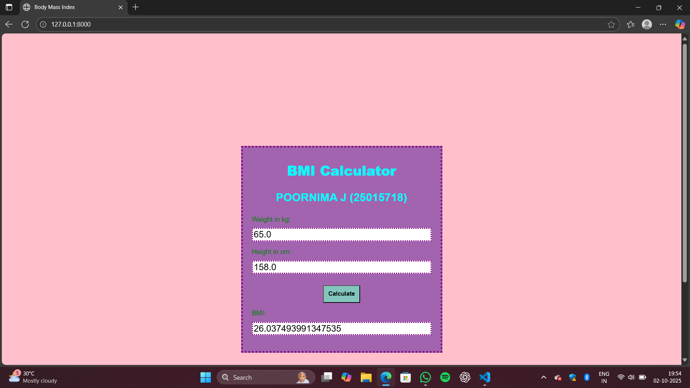

# Ex.05 Design a Website for Server Side Processing
## Date:02/10/2025

## AIM:
 To design a website to calculate the Body Mass Index (BMI) in the server side.

## FORMULA:
BMI=W/H2
 BMI-->Body Mass Index
  W--> Weight
  H--> Height

## DESIGN STEPS:

### Step 1:
Clone the repository from GitHub.

### Step 2:
Create Django Admin project.

### Step 3:
Create a New App under the Django Admin project.

### Step 4:
Create python programs for views and urls to perform server side processing.

### Step 5:
Create a HTML file to implement form based input and output.

### Step 6:
Publish the website in the given URL.

## PROGRAM :

bmi.html

<html>
    <head>
    <title>Body Mass Index</title>
    
    </head>
<body>
    

        <h1><b>BMI Calculator</b></h1>
        <h3 >POORNIMA J (25015718)</h3>
        <form method="post">
        
        

            <label for="Weight">Weight in kg:</label>
            <input type="number" name="weight" required value="{{weight}}">
        

        

            <label for="Height">Height in cm:</label>
            <input type="number" name="height" required value="{{height}}">
        

        

            <button type="submit"><b>Calculate</b></button>
        

        </form>
        
        

            <label for="bmi">BMI: </label>
            <input type="text" required value="{{bmi}}">
        

        
    

</body>
</html>

urls.py

from django.contrib import admin
from django.urls import path
from mathapp import views

urlpatterns=[
    path('admin/', admin.site.urls),
    path('',views.calculate_bmi,name='calculate_bmi'),
]

views.py

from django.shortcuts import render
def calculate_bmi(request):
    bmi=None
    catagory=None
    height=None
    weight=None
    if request.method=="POST":
        height=float(request.POST.get("height"))
        weight=float(request.POST.get("weight"))
        bmi=weight/((height/100)**2)
        print(f"Weight: {weight}kg \nHeight: {height}cm \nBMI: {bmi}")
    return render(request, "mathapp/bmi.html",{"bmi": bmi, "height": height, "weight": weight})

## SERVER SIDE PROCESSING:

## HOMEPAGE:

## RESULT:
The program for performing server side processing is completed successfully.
